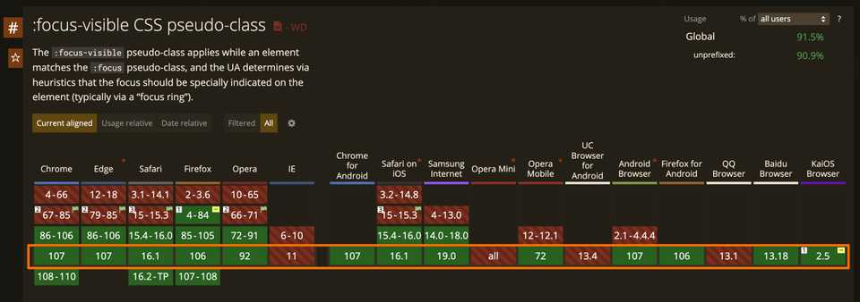

import Section from '#elements/Section'
import CodeBlock from '#elements/CodeBlock'

当页面上的一个元素被聚焦时，浏览器一般会添加 outline 属性并加深该属性的颜色，来给用户一个视觉上的反馈 —— 当前该元素被聚焦，用来帮助用户快速区分其和其他未被聚焦的元素。传统的做法是通过 `:focus` 伪类来完成，但是通过 `:focus-visible` 伪类，我们能做得更完美一些。

`:focus-visible` 伪类被投入使用已经有将近 7 年了，直到最近，所有现代浏览器都支持该伪类，除了 IE 11。



<Section title="什么是focus-visible">

严谨的说，`:focus-visible` **并不是只有使用键盘来聚焦元素时才生效**的伪类，其更像是，浏览器觉得合适的情况下才生效的伪类。

我们先来回顾一下默认的聚焦样式。当我们使用键盘的 Tab 键来聚焦按钮并点击的过程中，大多数浏览器会在被聚焦的元素样式上添加 outline 属性，但使用鼠标时却不会。

<button style={{ margin: "0 1rem" }}>按钮1</button>
<button style={{ margin: "0 1rem" }}>按钮2</button>

点击 `按钮1`，再按一下 Tab 键，此时会聚焦到按钮 2 元素上，同时会显示一圈深色（黑色）轮廓。但是用鼠标点击任何一个按钮，都不会显示深色轮廓。

换句话说，有些 focus 样式只应该在特定情况下显示，而 `:focus-visible` 正是对应了那些情况。

这使得 `:focus-visible` 和 `:focus` 有很大的不同，后者无论何种元素，无论是否有意义，都会在点击时启用其下定义的 CSS 规则。如用鼠标点击一个按钮，鼠标按下后就会添加 focus 中定义的 CSS。这难免会令一些开发者感到困惑，甚至会关掉浏览器中的聚焦样式显示。（但好哥们儿不会坑好哥们儿，就如同我们不会在 body 中添加 cursor: none 一样）

> 在此处暂不讨论 active 伪类和 focus 伪类的作用顺序问题。

根据 W3C 中的[定义](https://www.w3.org/TR/selectors-4/#the-focus-visible-pseudo)：

> `:focus-visible` 可以在不影响在 `:focus` 伪类下定义的样式的情况下，更改被聚焦元素的样式。

如上所述，`:focus-visible` 匹配了显示聚焦轮廓时的情况，重要的是，也排除了浏览器不会显示聚焦轮廓时的情况，如使用鼠标点击按钮时的情况。而 `:focus` 两种情况下都会被匹配到。

因此，当使用非鼠标设备进行聚焦时，浏览器会使用 `:focus-visible` 下定义的 CSS 规则。

根据[另一篇文章](https://css-tricks.com/focusing-on-focus-styles/)中的内容，有很多设备都可以视为类键盘设备。

> 魔杖、棍子、开关、口吸设备、语音识别和眼动追踪技术都可以在数字系统中创建输入。这些设备将识别内容区域并激活它。这类似于按下键盘上的 Tab 键，电子表格中的下一个单元格将突出显示，表明它已被移动到并准备好进行编辑。

<Section title="指针和非指针设备">

页面上任何可通过键盘或其他非指针设备交互的元素都应该考虑到 `:focus-visible` 伪类的设计。这就不得不说以下指针设备和非指针设备的区别，可以参考以下 W3C 中对指针事件的[定义](https://www.w3.org/TR/pointerevents2//)。

基本上，可以完成鼠标点击，或是其他任何不是鼠标但可以模拟鼠标点击的设备，如触屏或是触屏笔。指针事件尝试将这类输入法抽象为一个新的概念 —— **指针**。

W3C 中对指针事件的定义为：

> 可表示屏幕上的一个特定坐标（或一组坐标）的输入设备的**硬件无关(hardware agnostic)**表示，例如鼠标、笔或触摸接触。

> **硬件无关(hardware agnostic)**，也被称为设备无关(Device agnostic)。指不需要借助外界硬件适配器，能在各种系统之间通用，且不用考虑兼容性的设备。

虽然目前还没有找到一个对非指针设备的完整定义，但可以总结为以下描述：可以在用户界面中，不同的可交互区域之间来回切换的设备。这种切换也被称为**顺序导航**。

下面是一些非指针设备或顺序导航的例子：

- 使用键盘上的 Tab、Shift+Tab 或是方向键
- 在 iOS 上使用 VoiceOver 时的手势，您可以在不同的元素之间轻弹
- 开关控制中的项目模式（开关控制也有指针模式）

还有一种被称为空间导航的概念。这类似于顺序导航，但您不仅可以前后移动，还可以上下移动，就像您选择要在电视上的流媒体服务上观看的内容一样。

<Section title="输入设备的不同分类">

即便有了对指针设备和非指针设备的定义或描述，两者的关系也不能说是非此即彼。总会有从不使用鼠标或是键盘的用户，但大多数用户会介于两者之间。他们可能用鼠标点击了一个可交互元素之后，改用键盘来移动到其他可交互元素上。

`:focus-visible` 的好处在于它允许浏览器智能地决定何时显示焦点样式。当按下任意键时，浏览器不会直接跳入可见焦点模式，它会考虑使用命令/控制 + 组合键之类的事情。启发式也会随着时间的推移而发展。

</Section>

</Section>

</Section>

<Section title="设计">

无论使用那种设备浏览页面，有一个好的用户交互系统是最重要的。浏览器默认样式已经做的很好的，但有时我们需要一点不同。

比如，我们想在按钮聚焦时，启用一部分 CSS 规则，但不想在用户点击按钮时也触发这些规则。

<CodeBlock>

```css
&:hover {
  background: red;
  color: white;
}

&:focus {
  outline-color: #007dbc60;
  outline-offset: 0.5rem;
  transform: scale(1.5);
}
```

</CodeBlock>

在触发聚焦时改变 outline 的颜色，并使元素放大 1.5 倍，使元素看上去像是被聚焦了。

如上 CSS 有以下问题：

- 使用键盘导航时，outline 和 transform 均起作用。
- 但用鼠标点击时，outline 没有起作用，但元素还是被放大了。

当我们点击时，它也确实捕捉到了聚焦的状态。但你可能会疑惑，为什么 scale 起作用了，但 outline 没有起作用。

答案是，outline 属性只有在使用 focus-visible 匹配到的情况下才会可见。所以，用鼠标点击时，匹配到的时 focus 伪类，不会使其下的 outline 起效果。

:focus-visible 是一个伪类，当元素匹配 :focus 伪类并且用户代理通过启发式确定焦点应该在元素上明显时匹配。换句话说，当元素匹配 :focus 伪类时它匹配，但前提是应为该元素绘制焦点环或其他指示器。

为了解决上述提到的问题，我们可以简单地将 focus 改为 focus-visible。

以下是修复后的效果。

<iframe
  height="300"
  style={{ width:"100%" }}
  title="focus-visible-demo-01"
  src="https://codepen.io/Number_DDD/embed/ExeZqMR?default-tab=html%2Cresult"
  loading="lazy"
  allowtransparency="true"
  allowFullScreen={true}
>
  See the Pen{" "}
  <a href="https://codepen.io/Number_DDD/pen/ExeZqMR">focus-visible-demo-01</a>{" "}
  by lorem314 (<a href="https://codepen.io/Number_DDD">@Number_DDD</a>) on{" "}
  <a href="https://codepen.io">CodePen</a>.
</iframe>

用鼠标点击登录按钮不会触发放大效果，使用键盘则会触发放大效果。

</Section>

<Section title="参考文章">

- [https://trungk18.com/experience/focus-and-focus-visible/](https://trungk18.com/experience/focus-and-focus-visible/)
- [https://pawelgrzybek.com/the-difference-between-css-focus-and-focus-visible-pseudo-class/](https://pawelgrzybek.com/the-difference-between-css-focus-and-focus-visible-pseudo-class/)
- [https://hidde.blog/focus-visible-more-than-keyboard/](https://hidde.blog/focus-visible-more-than-keyboard/)

</Section>
