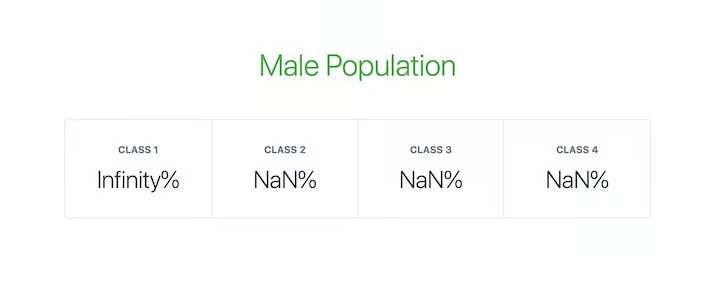

import Section from '#elements/Section'
import CodeBlock from '#elements/CodeBlock'
import Figure from '#elements/Figure'

在向 React 组件中传递变量时，明确该变量的类型十分重要。若组件接收了错误的类型参数，可能会导致程序出错。

由于 JavaScript 中没有内置的类型检查机制，很多开发者使用 TypeScript 或 Flow 来保证参数的类型正确，而 React 中有 `PropTypes`，是一个专门用于规定组件参数的机制。

<Section title="为何使用类型检查">

在开发 React 应用时，需要设计组件，必然会考虑组件的参数，组件需要参数才能正确渲染。比如下面的例子：

<CodeBlock>

```js
import React from "react"
import ReactDOM from "react-dom"

function PercentageStat({ label, score = 0, total = Math.max(1, score) }) {
  return (
    <div>
      <h6>{label}</h6>
      <span>{Math.round((score / total) * 100)}%</span>
    </div>
  )
}

function App() {
  return (
    <div>
      <h1>Male Population</h1>
      <div>
        <PercentageStat label="Class 1" total={360} score={203} />
        <PercentageStat label="Class 2" total={206} />
        <PercentageStat label="Class 3" score={107} />
        <PercentageStat label="Class 4" />
      </div>
    </div>
  )
}

const rootElement = document.getElementById("root")
ReactDOM.render(<App />, rootElement)
```

</CodeBlock>

如上代码中，PercentageStat 组件接收 3 个参数，label、score 和 total。score 和 total 有默认值，其余的没有提供。该组件在 App 组件中渲染了 4 次，每次都用了不同的参数。

下面的图片展示了正常情况下的样子：


根据使用时的标准，label 变量为标题，为字符串类型；score 和 total 涉及到计算，应为数字类型，另外，total 在计算中作为除数，不应为 0 。

以下是提供了不合法参数的 `PercentageStat` 组件：

<CodeBlock>

```jsx
function App() {
  return (
    <div>
      <h1>Male Population</h1>
      <div>
        <PercentageStat label="Class 1" total="0" score={203} />
        <PercentageStat label="Class 2" total={0} />
        <PercentageStat label="Class 3" score={(f) => f} />
        <PercentageStat label="Class 4" total={{}} score="0" />
      </div>
    </div>
  )
}
```

</CodeBlock>

此时，渲染情况如下：



</Section>

<Section title="安装">

在 React 文档中指出，`React.PropTypes` 已经于 15.5.0 之后的版本中移除到了名为 prop-types 单独的代码包中。

我们可以使用如下代码来安装：

<CodeBlock>

```bash
npm install --save prop-types
```

</CodeBlock>

之后便可以在项目中引入，进而使用：

<CodeBlock>

```jsx
import PropTypes from "prop-types"
```

</CodeBlock>

</Section>

<Section title="定义类型">

目前 React 中有两种定义组件的方法，一种是函数组件，一种是类组件。

<CodeBlock>

```jsx
// 函数组件
function ReactComponent(props) {
  return null
}
ReactComponent.propTypes = {
  // 定义参数类型
}

// 类组件 方法 1
class ReactComponent extends React.Component {
  render() {
    return null
  }
}
ReactComponent.propTypes = {
  // 定义参数类型
}

// 类组件 方法 2
class ReactComponent extends React.Component {
  static propTypes = {
    // 定义参数类型
  }
}
```

</CodeBlock>

当组件被调用时，会触发类型检查，控制台中会输出警告。

</Section>

<Section title="类型检查">

`PropTypes` 中提供了很多用于规定类型的方法。这些类型可以是 JavaScript 中的原始类型或通过 new 关键字实例化的类对象、或是由特定类型元素组成的 Array 和特定类型的属性组成的 Object、或是 JSX 中新增的能被渲染成 HTML 的类型、或是规定参数的值只能为某些特定值和枚举类型，最后还提供了可自定义的类型。

<Section title="基础类型">

下面是一些常用的基础数据类型：

- `PropTypes.bool`：布尔类型，`true` 或 `false`
- `PropTypes.number`：数字类型，如 `114514` 或 `3.14159`
- `PropTypes.string`：字符串类型，如 `'Greetings'` 或 `'Error: this type is not expected'`
- `PropTypes.func`：函数类型，如一个空函数 `() ⇒ {}`，或`(event) ⇒ { setValue(event.target.value) }`
- `PropTypes.array`：数组类型，如 `[1, 'deux', 'three', 'よん', ()=>'五']`
- `PropTypes.object`：对象类型，如 `{ name: 'Jojo', age: 18}`
- `PropTypes.symbol`：symbol 类型，如 `Symbol(42)`，或 `Symbol.for('react.element')`

除了上述的 7 中类型，还可以是任意类型

- `PropTypes.any`：可以是任意一种类型

<CodeBlock>

```jsx
MyComponent.propTypes = {
  booleanProp: PropTypes.bool,
  numberProp: PropTypes.number,
  stringProp: PropTypes.string,
  functionProp: PropTypes.func,
  arrayProp: PropTypes.array,
  objectPerop: PropTypes.object,
  symbolProp: PropTypes.symbol,
  anyProp: PropTypes.any,
}
```

</CodeBlock>

</Section>

<Section title="可渲染类型">

- `PropTypes.node`：任何能由 React 渲染的类型，如 number、string、React 元素、array 或空标签
- `PropTypes.element`：只能是 React 元素，即 JSX

<CodeBlock>

```jsx
Component.propTypes = {
  nodeProp: PropTypes.node,
  elementProp: PropTypes.element,
}
```

</CodeBlock>

`PropTypes.element` 的一个常用场景是，确保组件只有一个子组件。

<CodeBlock>

```jsx
Component.propTypes = {
  children: PropTypes.element.isRequired,
}
```

</CodeBlock>

</Section>

<Section title="实例类型">

用于检查值是否为特定类的实例。

```jsx
Component.propTypes = {
  personProp: PropTypes.instanceOf(Person),
}
```

</Section>

<Section title="多类型">

用于对属性的值进行规定。

- `PropTypes.oneOf`：规定参数的值只能是给定的值中的一种，和枚举类型类似
- `PropTypes.oneOfType`：规定参数的类型只能是给定的类型中的一种

<CodeBlock>

```jsx
Component.propTypes = {
  enumProp: PropTypes.oneOf([true, false, 0, "Unknown"]),

  unionProp: PropTypes.oneOfType([
    PropType.bool,
    PropType.number,
    PropType.string,
    PropType.instanceOf(Person),
  ]),
}
```

</CodeBlock>

</Section>

<Section title="集合类型">

我们还可以针对元素中的元素和 Object 中的属性规定类型。

<Section title="PropTypes.arrayOf">

规定了数组中的元素的类型

<CodeBlock>

```jsx
Component.propTypes = {
  peopleArrayProp: PropTypes.arrayOf(PropTypes.instanceOf(Person)),

  multipleArrayProp: PropTypes.arrayOf(
    PropTypes.oneOfType([PropType.number, PropType.string])
  ),
}
```

</CodeBlock>

</Section>

<Section title="PropTypes.objectOf">

规定了 Object 中的属性的类型

<CodeBlock>

```jsx
Component.propTypes = {
  booleanObjectProp: PropTypes.objectOf(PropTypes.bool),

  multipleObjectProp: PropTypes.objectOf(
    PropTypes.oneOfType([
      PropType.func,
      PropType.number,
      PropType.string,
      PropType.instanceOf(Person),
    ])
  ),
}
```

</CodeBlock>

</Section>

<Section title="PropTypes.shape">

适用于更加精确的 Object 属性，规定一个 Object 属性中的属性名和属性类型

<CodeBlock>

```jsx
Component.propTypes = {
  profileProp: PropTypes.shape({
    id: PropTypes.number,
    fullname: PropTypes.string,
    gender: PropTypes.oneOf(["M", "F"]),
    birthdate: PropTypes.instanceOf(Date),
    isAuthor: PropTypes.bool,
  }),
}
```

</CodeBlock>

</Section>

<Section title="PropTypes.exact">

类型检查默认情况下，不对没有在其中列出的属性进行检查，即默许可以出现没有列出在其中的属性。而该方法在出现多余参数时给出警告

<CodeBlock>

```jsx
Component.propTypes = {
  subjectScoreProp: PropTypes.exact({
    subject: PropTypes.oneOf(["Maths", "Arts", "Science"]),
    score: PropTypes.number,
  }),
}
```

</CodeBlock>

</Section>

<Section title="必要声明">

之上所有的提及的属性都是可选的，即可提供可不提供。我们可在其之后加上 `isRequired` 来在没有提供该参数的值时给出警告

<CodeBlock>

```jsx
Component.propTypes = {
  requiredAnyProp: PropTypes.any.isRequired,
  requiredFunctionProp: PropTypes.func.isRequired,
  requiredSingleElementProp: PropTypes.element.isRequired,
  requiredPersonProp: PropTypes.instanceOf(Person).isRequired,
  requiredEnumProp: PropTypes.oneOf(["Read", "Write"]).isRequired,

  requiredShapeObjectProp: PropTypes.shape({
    title: PropTypes.string.isRequired,
    date: PropTypes.instanceOf(Date).isRequired,
    isRecent: PropTypes.bool,
  }).isRequired,
}
```

</CodeBlock>

</Section>

</Section>

<Section title="自定义类型检查">

通常，我们会需要自定义验证流程，如确保用户输入的为邮箱地址等。

<Section title="基础类型检查">

自定义验证函数接收 3 个参数：

- props：一个 Object，包含了所有传入组件的参数
- propName：当前检测的参数名
- componentName：组件名

若验证出错，应该返回一个 new Error 实例，而非 throw Error。另外，也不应该在该函数中使用 `console.warn` 来输出错误。

<CodeBlock>

```jsx
const isEmail = function(props, propName, componentName) {
  const regex = /^((([^<>()[]\.,;:s@"]+(.[^<>()[]\.,;:s@"]+)*)|(".+"))@(([[0-9]{1,3}.[0-9]{1,3}.[0-9]{1,3}.[0-9]{1,3}])|(([a-zA-Z-0-9]+.)+[a-zA-Z]{2,})))?$/;

  if (!regex.test(props[propName])) {
    return new Error(`Invalid prop `${propName}` passed to `${componentName}`. Expected a valid email address.`);
  }
}

Component.propTypes = {
  email: isEmail,
  fullname: PropTypes.string,
  date: PropTypes.instanceOf(Date)
}
```

</CodeBlock>

还可以将自定义函数和内置函数一起使用：

<CodeBlock>

```jsx
Component.propTypes = {
  email: PropTypes.oneOfType([
    isEmail,
    PropTypes.shape({
      address: isEmail,
    }),
  ]),
}
```

</CodeBlock>

向组件提供的 email 参数通过自定义函数 isEmail 或内置 PropTypes.shape 其中一个验证即可，即下面两种写法均可以

<CodeBlock>

```jsx
<Component email="glad@me.com" />
<Component email={{ address: 'glad@me.com' }} />
```

</CodeBlock>

</Section>

<Section title="检查自定义集合类型">

同样，我们也可以在 `PropTypes.arrayOf` 和 `PropTypes.objectOf` 中使用自定义函数。这种情况下，自定义函数会遍历数组或 Object 中的每个元素或属性。

此时，自定义函数接收 5 个参数，而不是 3 个。

- propValue：数组或 Object 本身
- key：当前遍历的键
- componentName：组件名
- location：通常为 prop
- propFullName：全名。对数组来说是 array[index]；对 Obejct 来说是 object.key。

<CodeBlock>

```jsx
const isEmail = function(propValue, key, componentName, location, propFullName) {
  const regex = /^((([^<>()[]\.,;:s@"]+(.[^<>()[]\.,;:s@"]+)*)|(".+"))@(([[0-9]{1,3}.[0-9]{1,3}.[0-9]{1,3}.[0-9]{1,3}])|(([a-zA-Z-0-9]+.)+[a-zA-Z]{2,})))?$/;

  if (!regex.test(propValue[key])) {
    return new Error(`Invalid prop `${propFullName}` passed to `${componentName}`. Expected a valid email address.`);
  }
}

Component.propTypes = {
  emails: PropTypes.arrayOf(isEmail)
}
```

</CodeBlock>

</Section>

<Section title="通用自定义验证函数">

结合前面所讲的，让我们来创建一个既可以用于单独验证，又可以用于 `oneOfType` 等方法中的通用函数。

只要稍加修改，`isEmail` 函数便可以应用与各种场合。

<CodeBlock>

```jsx
const isEmail = function(propValue, key, componentName, location, propFullName) {
  // Get the resolved prop name based on the validator usage
  const prop = (location && propFullName) ? propFullName : key;

  const regex = /^((([^<>()[]\.,;:s@"]+(.[^<>()[]\.,;:s@"]+)*)|(".+"))@(([[0-9]{1,3}.[0-9]{1,3}.[0-9]{1,3}.[0-9]{1,3}])|(([a-zA-Z-0-9]+.)+[a-zA-Z]{2,})))?$/;

  if (!regex.test(propValue[key])) {
    return new Error(`Invalid prop `${prop}` passed to `${componentName}`. Expected a valid email address.`);
  }
}

Component.propTypes = {
  email: PropTypes.oneOfType([
    isEmail,
    PropTypes.shape({
      address: isEmail
    })
  ]),
  emails: PropTypes.arrayOf(isEmail)
}
```

</CodeBlock>

</Section>

</Section>

</Section>

<Section title="例子">

<CodeBlock>

```jsx
import React from "react"
import PropTypes from "prop-types"

// The PercentageStat component
function PercentageStat({ label, score = 0, total = Math.max(1, score) }) {
  return (
    <div>
      <h6>{label}</h6>
      <span>{Math.round((score / total) * 100)}%</span>
    </div>
  )
}

// Checks if a value is numeric
// Either a finite number or a numeric string
function isNumeric(value) {
  const regex = /^(\+|-)?((\d*\.?\d+)|(\d+\.?\d*))$/
  return (
    Number.isFinite(value) || (typeof value === "string" && regex.test(value))
  )
}

// Checks if value is non-zero
// Value is first converted to a number
function isNonZero(value) {
  return +value !== 0
}

// Takes test functions as arguments and returns a custom validation function.
// Each function passed in as argument is expected to take a value argument
// expected to accept a value and return a Boolean if it passes the validation.
// All tests must pass for the custom validator to be marked as passed.
function validatedType(...validators) {
  return function (props, propName, componentName) {
    const value = props[propName]

    const valid = validators.every((validator) => {
      if (typeof validator === "function") {
        const result = validator(value)
        return typeof result === "boolean" && result
      }

      return false
    })

    if (!valid) {
      return new Error(
        `Invalid prop \`${propName}\` passed to \`${componentName}\`. Validation failed.`
      )
    }
  }
}

// Set the propTypes for the component
PercentageStat.propTypes = {
  label: PropTypes.string.isRequired,
  score: validatedType(isNumeric),
  total: validatedType(isNumeric, isNonZero),
}
```

</CodeBlock>

</Section>
